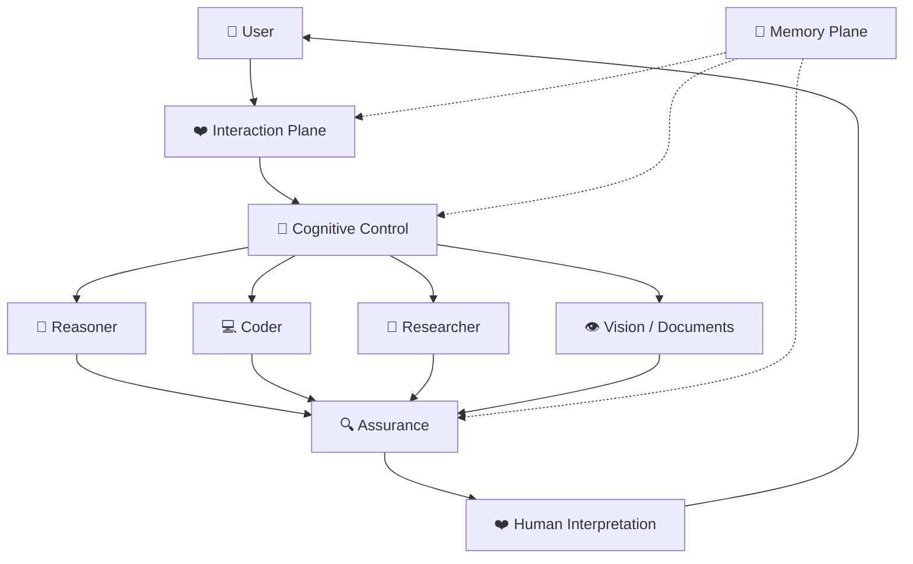

🌐 **Language / Язык:** 🇬🇧 **English** · [🇷🇺 Русский](ru/ARCHITECTURE.md)

# 🧬 Velantrim Cognitive OS — Architecture

## 1. Architectural thesis

Velantrim Cognitive OS treats an LLM as a **replaceable cognitive processor**, not as the permanent identity of the system.

The persistent system consists of five cooperating planes:

1. ❤️ Interaction Plane
2. 🧭 Cognitive Control Plane
3. 🧠 Capability Plane
4. 🔍 Assurance Plane
5. 💾 Memory Plane

The objective is graceful replacement, specialization and degradation containment.

---

## 2. System view



---

## 3. ❤️ Interaction Plane

Responsibilities:

- intent interpretation;
- conversational pragmatics;
- tone and emotional calibration;
- humor and timing;
- explanation depth;
- writing and creativity;
- user-model-aware presentation;
- semantic handoff to machine-oriented components;
- human-readable interpretation of technical output.

It should not silently become the authoritative technical verifier.

---

## 4. 🧭 Cognitive Control Plane

The control plane chooses the cognitive configuration for each task.

Inputs may include:

- task type;
- complexity;
- uncertainty;
- risk;
- privacy requirements;
- latency target;
- budget;
- modality;
- previous failures;
- available models/tools.

Outputs may include:

```yaml
execution_plan:
  model_family: ...
  role: ...
  reasoning_effort: low|medium|high|xhigh|max
  serving_mode: standard|fast|other
  reasoning_strategy: direct|cot|react|plan_execute|reflection
  context_policy: ...
  tools: [...]
  verifier: ...
  budget: ...
```

The router should be able to switch strategy after failure rather than only raising token budget.

---

## 5. 🧠 Capability Plane

The Capability Plane contains interchangeable specialists.

Possible roles:

- strategic reasoner;
- coding agent;
- research model;
- multimodal model;
- document processor;
- theorem/reasoning specialist;
- low-cost worker;
- local/private worker;
- long-horizon orchestrator.

A provider is not a role. A role can be filled by different providers over time.

---

## 6. 🔍 Assurance Plane

The Assurance Plane exists because self-review is correlated with the generator's original assumptions.

Verification methods:

- unit/integration tests;
- compiler/type checker;
- static analysis;
- formal verification where possible;
- source-backed factual verification;
- independent model review;
- cross-vendor adversarial review;
- deterministic policy checks;
- constraint validation.

Trust should be based on **evidence**, not confidence language.

---

## 7. 💾 Memory Plane

Memory must be structured and typed.

```text
💾 Memory
├── 👤 User Model
├── 🎯 Task State
├── 📜 Episodic Memory
├── 📚 Semantic Knowledge
├── ✅ Verified Facts
├── 🔥 Hot Context
├── 🌤 Warm Context
└── ❄️ Cold Archive
```

Important distinctions:

- preference ≠ fact;
- belief ≠ fact;
- summary ≠ source;
- retrieved memory ≠ necessarily relevant memory.

Every important summary should carry provenance and confidence.

---

## 8. Semantic handoff protocol

The Interaction Layer should enrich, not overwrite, the user's original intent.

```yaml
request:
  original_user_message: ...
  interpreted_intent: ...
  user_level: ...
  desired_depth: ...

constraints:
  ...

uncertainties:
  - ...

do_not_assume:
  - ...

requested_output:
  - findings
  - tradeoffs
  - recommendation
  - uncertainties
  - evidence
```

This prevents the Interaction Model from becoming a lossy codec.

---

## 9. Stable identity, replaceable backends

The system should preserve continuity across backend changes.

```text
Stable:
❤️ interaction policy
💾 user/task memory
🧭 routing policy
🔍 verification policy
🎯 task invariants

Replaceable:
🧠 frontier reasoner
💻 coder
🔎 researcher
👁 multimodal model
⚡ worker models
```

A backend upgrade should be an infrastructure change, not a personality transplant.

---

## 10. Architectural invariants

1. The original objective is stored outside transient context.
2. Hard constraints cannot be silently rewritten by the active model.
3. Important technical claims require evidence or verification.
4. A model does not automatically verify itself.
5. Model upgrades are admitted by role, not globally.
6. Memory entries are typed and provenance-aware.
7. Reasoning effort is dynamic.
8. Repeated failure may trigger strategy/model change, not just more compute.
9. Interaction quality is evaluated independently from technical capability.
10. Vendor-specific behavior must not define system identity.

---

## 11. Long-term target

The end state is a **cognitive operating system** in which models are scheduled similarly to computational resources: selected by role, cost, risk, latency and required independence, while the user experiences one coherent persistent intelligence.

> For the complete architectural narrative and all anti-degradation rules, see [📜 Full Canonical Handoff](FULL_HANDOFF.md).