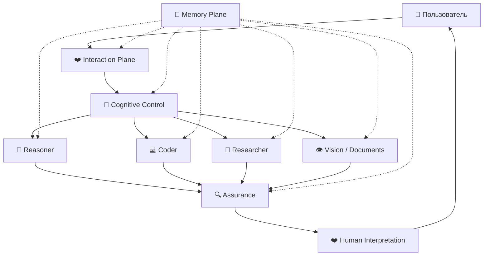

🌐 **Язык / Language:** [🇬🇧 English](../ARCHITECTURE.md) · 🇷🇺 **Русский**

# 🧬 Velantrim Cognitive OS — Архитектура

## 1. Архитектурный тезис

Velantrim Cognitive OS рассматривает LLM как **заменяемый когнитивный процессор**, а не как постоянную личность и не как единственный источник непрерывности системы.

Постоянный интеллект системы складывается из пяти взаимодействующих плоскостей:

1. ❤️ Interaction Plane
2. 🧭 Cognitive Control Plane
3. 🧠 Capability Plane
4. 🔍 Assurance Plane
5. 💾 Memory Plane

Главная цель — обеспечить специализацию, независимую проверку, устойчивую память, заменяемость backend-моделей и локализацию деградации.

> **Модель может измениться. Система должна сохранить свою цель, память, способ общения и правила доверия.**

---

## 2. Общий вид системы



Важный смысл схемы: пользователь взаимодействует с **единым человеческим интерфейсом**, но внутри за этой непрерывностью может стоять множество разных моделей, инструментов и проверок.

---

## 3. ❤️ Interaction Plane

Главный объект этого слоя — **человек, намерение и коммуникация**.

Ответственность:

- интерпретация intent;
- прагматика разговора;
- тон и эмоциональная калибровка;
- юмор, ирония и чувство момента;
- выбор глубины объяснения;
- письмо, творчество и storytelling;
- использование user model;
- semantic handoff к техническим компонентам;
- преобразование technical output в человеческий смысл;
- отслеживание незакрытых мыслей и целей разговора.

Interaction Plane не должен автоматически становиться техническим verifier только потому, что умеет убедительно объяснять.

Его вопрос:

> **«Что человек имеет в виду, чего он пытается добиться и как лучше всего представить ему результат?»**

---

## 4. 🧭 Cognitive Control Plane

Control Plane выбирает **когнитивную конфигурацию** для каждой задачи.

Он может учитывать:

- тип задачи;
- сложность;
- uncertainty;
- риск;
- privacy requirements;
- latency target;
- budget;
- modality;
- предыдущие ошибки;
- доступные модели;
- доступные tools;
- необходимость независимого verifier;
- требуемую степень автономности.

Пример результата routing:

```yaml
execution_plan:
  role: strategic_reasoner
  model_family: ...
  reasoning_effort: high
  serving_mode: standard
  reasoning_strategy: plan_execute
  context_policy: compact_relevant
  tools:
    - repository_search
    - docs_search
  verifier:
    type: independent_family
  budget:
    cost: medium
    latency: normal
```

Router должен уметь **сменить стратегию**, а не только увеличивать число reasoning tokens.

---

## 5. 🧠 Capability Plane

Capability Plane содержит взаимозаменяемых специалистов.

Возможные роли:

- 🧠 strategic reasoner;
- 💻 coding agent;
- 🔎 research model;
- 👁 multimodal / vision model;
- 📄 document processor;
- 🧮 theorem / reasoning specialist;
- ⚡ low-cost worker;
- 🏠 local/private worker;
- 🤖 long-horizon orchestrator;
- 🛠 computer-use / tool-execution model;
- 🔐 privacy-specialized local model.

**Provider не является ролью.** Сегодня роль Coder может выполнять одна модель, завтра другая. Система должна мыслить категориями capability, а не бренда.

---

## 6. 🔍 Assurance Plane

Assurance Plane нужен потому, что self-review коррелирует с исходными предположениями генератора.

Возможные методы проверки:

- unit/integration tests;
- compiler/type checker;
- static analysis;
- formal verification;
- source-backed factual verification;
- database constraints;
- deterministic policy checks;
- independent model review;
- cross-vendor adversarial review;
- acceptance criteria validation.

Главный принцип:

> **Доверие должно строиться на evidence, а не на уверенном тоне модели.**

---

## 7. 💾 Memory Plane

Память должна быть структурированной, типизированной и независимой от transcript.

```text
💾 Memory
├── 👤 User Model
├── 🎯 Task State
├── 📜 Episodic Memory
├── 📚 Semantic Knowledge
├── ✅ Verified Facts
├── 🔥 Hot Context
├── 🌤 Warm Context
└── ❄️ Cold Archive
```

Критические различия:

- preference ≠ fact;
- belief ≠ fact;
- summary ≠ source;
- remembered ≠ relevant;
- confidence ≠ verification;
- old fact ≠ current fact.

Каждая важная summary должна иметь provenance, timestamp и confidence.

---

## 8. Semantic handoff protocol

Interaction Layer должен **обогащать**, а не заменять исходный user signal.

```yaml
request:
  original_user_message: ...
  interpreted_intent: ...
  user_level: ...
  desired_depth: ...

constraints:
  ...

uncertainties:
  - ...

do_not_assume:
  - ...

requested_output:
  - findings
  - tradeoffs
  - recommendation
  - uncertainties
  - evidence
```

Исходное сообщение сохраняется, потому что Human/Interaction Model сама может ошибиться при интерпретации. Иначе она превращается в **lossy semantic codec**.

---

## 9. Stable identity, replaceable backends

Система должна сохранять непрерывность при смене backend-моделей.

```text
Стабильно:
❤️ interaction policy
💾 user/task memory
🧭 routing policy
🔍 verification policy
🎯 task invariants
📜 provenance

Заменяемо:
🧠 frontier reasoner
💻 coder
🔎 researcher
👁 multimodal model
⚡ worker models
```

Backend upgrade должен быть инфраструктурным обновлением, а не «пересадкой личности» всей системе.

---

## 10. Architectural invariants

1. Исходная цель хранится вне transient context.
2. Hard constraints нельзя молча переписывать активной модели.
3. Важные технические утверждения требуют evidence или verification.
4. Модель не считается достаточным verifier самой себя.
5. Model upgrades допускаются по роли, а не глобально.
6. Memory entries типизированы и имеют provenance.
7. Reasoning effort динамический.
8. Повторная ошибка может привести к смене strategy/model, а не только к росту compute.
9. Interaction quality оценивается независимо от technical capability.
10. Vendor-specific behavior не должен определять identity системы.
11. Summary не является первичным источником истины.
12. User preference не превращается в objective fact.
13. Verification failure должен быть видимым состоянием, а не скрытым поводом для бесконечных retries.
14. Система должна уметь завершить задачу состоянием `unresolved`, если доказательств недостаточно.
15. Любая долговременная автономность должна быть восстанавливаема из explicit state.

---

## 11. Context architecture

Вместо бесконечного transcript:

```text
EVERYTHING EVER SAID
        ↓
гигантский prompt
```

предпочтительно:

```text
Original Objective
+ Current State
+ Relevant Memory
+ Recent Trajectory
+ Required Evidence
```

Полная история остаётся во внешнем архиве и может быть восстановлена при споре или forensic analysis.

---

## 12. Failure recovery

При признаках деградации:

```text
STOP trajectory
      ↓
restore task invariants
      ↓
extract verified state
      ↓
compact / fresh context
      ↓
replan
      ↓
change model/strategy if needed
      ↓
independent verification
```

Цель — не заставить одну trajectory жить бесконечно, а сохранить **целостность задачи**.

---

## 13. Long-term target

Конечная цель — **Cognitive Operating System**, где модели планируются подобно вычислительным ресурсам: по роли, стоимости, риску, latency, privacy и требуемой независимости, а пользователь воспринимает одну последовательную интеллектуальную систему.

```text
LLM = processor
Memory = persistent state
Router = scheduler
Assurance = trust boundary
Interaction = human interface
Cognitive OS = persistent intelligence
```

> **Целостность принадлежит системе, а не одному checkpoint.**